# Code Flow Walkthrough

This document is a practical guide for explaining the project in a code review.
It follows the real runtime flow: what screen appears, what function is called,
what observer emits, which module owns each decision, and how data moves between
the two separate Android apps.

## One-Minute Explanation

The project contains two independently installable Android apps:

- `UnityNewsApp`: the reader UI app.
- `backend`: the local backend/control app.

The reader app never reads the JSON file directly. It renders a Compose screen,
observes cached articles from Room, and asks the backend app for fresh filtered
articles through AIDL. The backend app owns the article JSON, owns the filtering
logic, validates the caller, applies demo scenarios, and returns Parcelable DTOs.
When the reader receives a successful backend response, it writes the result into
Room. Because the UI is already observing Room, the screen updates automatically.

The important architecture sentence:

> Presentation talks to use cases, use cases talk to repository interfaces, the
> repository coordinates local cache and remote backend, and only the data layer
> knows that the current remote transport is Android AIDL.

## Module Responsibility Map

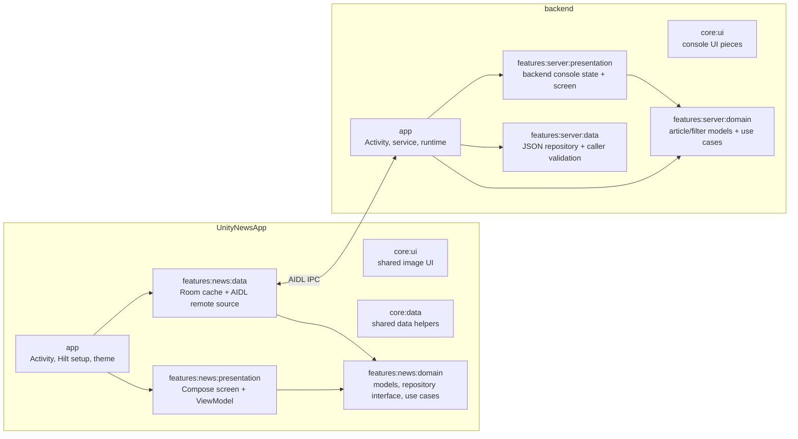
```mermaid
flowchart LR
    subgraph Reader["UnityNewsApp"]
        ReaderApp["app\nActivity, Hilt setup, theme"]
        ReaderCoreUi["core:ui\nshared image UI"]
        ReaderCoreData["core:data\nshared data helpers"]
        NewsPresentation["features:news:presentation\nCompose screen + ViewModel"]
        NewsDomain["features:news:domain\nmodels, repository interface, use cases"]
        NewsData["features:news:data\nRoom cache + AIDL remote source"]
    end

    subgraph Backend["backend"]
        BackendApp["app\nActivity, service, runtime"]
        BackendCoreUi["core:ui\nconsole UI pieces"]
        ServerPresentation["features:server:presentation\nbackend console state + screen"]
        ServerDomain["features:server:domain\narticle/filter models + use cases"]
        ServerData["features:server:data\nJSON repository + caller validation"]
    end

    NewsPresentation --> NewsDomain
    NewsData --> NewsDomain
    ReaderApp --> NewsPresentation
    ReaderApp --> NewsData
    NewsData <-- "AIDL IPC" --> BackendApp
    BackendApp --> ServerDomain
    BackendApp --> ServerData
    ServerPresentation --> ServerDomain
    BackendApp --> ServerPresentation
```

Dependency rule:

- Reader presentation does not know about AIDL, Room, JSON, or the backend app.
- Reader domain does not know about Android framework classes.
- Reader data is the only reader feature layer that knows about Room and AIDL.
- Backend domain owns filtering rules.
- Backend data owns loading/parsing the local JSON source.
- Backend app owns the Android service boundary.

## Reader App: Screen Load Flow

When the reader app launches, this is the exact high-level call chain.

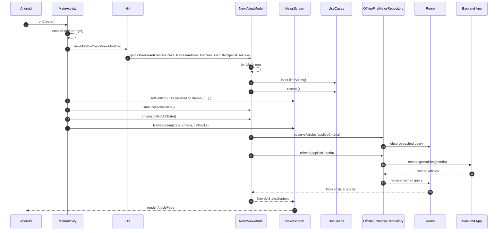
```mermaid
sequenceDiagram
    autonumber
    participant Android
    participant Activity as MainActivity
    participant Hilt
    participant VM as NewsViewModel
    participant Compose as NewsScreen
    participant UseCases
    participant Repo as OfflineFirstNewsRepository
    participant Room
    participant Backend as Backend App

    Android->>Activity: onCreate()
    Activity->>Activity: enableEdgeToEdge()
    Activity->>Hilt: viewModels<NewsViewModel>()
    Hilt->>VM: inject ObserveArticlesUseCase, RefreshArticlesUseCase, GetFilterSpecsUseCase
    VM->>VM: init block runs
    VM->>UseCases: loadFilterSpecs()
    VM->>UseCases: refresh()
    Activity->>Compose: setContent { UnityNewsAppTheme { ... } }
    Activity->>VM: state.collectAsState()
    Activity->>VM: criteria.collectAsState()
    Activity->>Compose: NewsScreen(state, criteria, callbacks)
    VM->>Repo: observeArticles(appliedCriteria)
    Repo->>Room: observe cached query
    VM->>Repo: refresh(appliedCriteria)
    Repo->>Backend: remote.getArticles(criteria)
    Backend-->>Repo: filtered articles
    Repo->>Room: replace cached query
    Room-->>VM: Flow emits article list
    VM-->>Compose: NewsUiState.Content
    Compose-->>Android: render ArticleFeed
```

Concrete code path:

1. `UnityNewsApp/app/src/main/java/com/example/unitynewsapp/MainActivity.kt`
   creates the screen.
2. `private val viewModel: NewsViewModel by viewModels()` asks Hilt for the
   ViewModel.
3. `setContent { UnityNewsAppTheme { ... } }` starts Compose rendering.
4. `val state by viewModel.state.collectAsState()` subscribes Compose to the
   public UI state.
5. `val criteria by viewModel.criteria.collectAsState()` subscribes Compose to
   the draft filter state.
6. `NewsScreen(...)` receives state plus callbacks such as `viewModel::refresh`
   and `viewModel::applyFilters`.
7. `NewsViewModel.init` immediately calls:
   - `loadFilterSpecs()`
   - `refresh()`

The Activity is intentionally thin. It does not load articles, filter data, open
Room, bind services, or parse JSON.

## Reader App: Dependency Injection Flow

`UnityNewsApp/app/src/main/java/com/example/unitynewsapp/di/NewsAppModule.kt`
builds the production object graph.

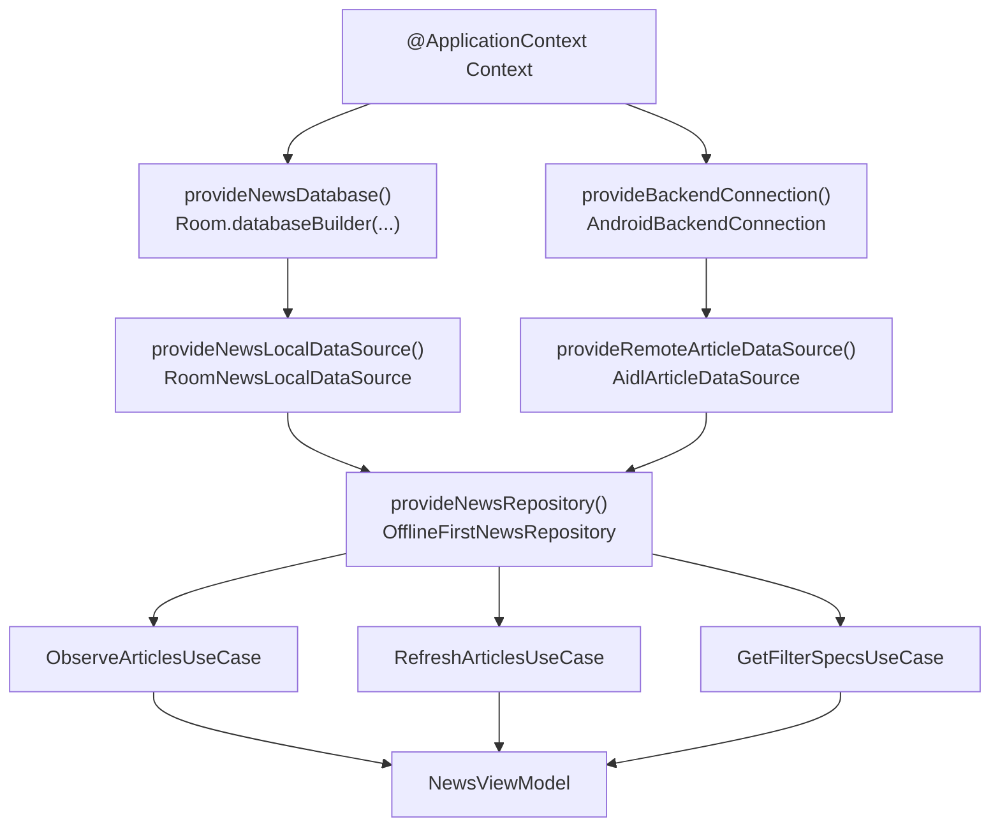
```mermaid
flowchart TD
    Context["@ApplicationContext Context"]

    Context --> RoomDb["provideNewsDatabase()\nRoom.databaseBuilder(...)"]
    RoomDb --> Local["provideNewsLocalDataSource()\nRoomNewsLocalDataSource"]

    Context --> Connection["provideBackendConnection()\nAndroidBackendConnection"]
    Connection --> Remote["provideRemoteArticleDataSource()\nAidlArticleDataSource"]

    Local --> Repo["provideNewsRepository()\nOfflineFirstNewsRepository"]
    Remote --> Repo

    Repo --> Observe["ObserveArticlesUseCase"]
    Repo --> Refresh["RefreshArticlesUseCase"]
    Repo --> Specs["GetFilterSpecsUseCase"]

    Observe --> VM["NewsViewModel"]
    Refresh --> VM
    Specs --> VM
```

Why this matters in the interview:

- If the backend becomes a real HTTP server, we can add a new
  `RemoteArticleDataSource` implementation and change the Hilt provider.
- `NewsViewModel`, use cases, and domain models do not need to change.
- Tests can inject fake repositories/use cases without Android IPC.

## Reader App: ViewModel State Flow

`NewsViewModel` is the reader screen state holder.

Main fields:

- `mutableDraftCriteria`: filters currently edited by the user.
- `criteria`: public read-only draft filters for Compose.
- `appliedCriteria`: filters actually sent to cache/backend.
- `filters`: backend-provided filter definitions.
- `isRefreshing`: disables duplicate refresh taps.
- `staleMessage`: warning shown when refresh fails but cached data remains.
- `backendMissing`: true when backend calls fail in a missing-backend style.
- `streamErrorMessage`: hard error from the local observation stream.
- `observeRevision`: forces re-observation after refresh for the same criteria.

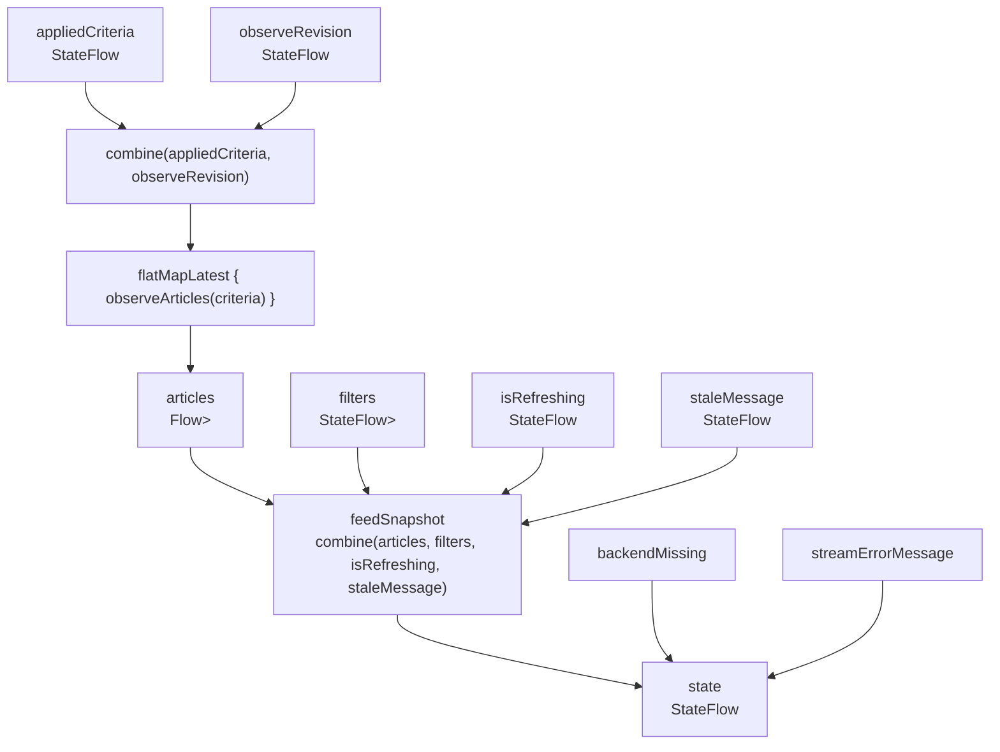
```mermaid
flowchart TD
    Applied["appliedCriteria\nStateFlow<FilterCriteria>"]
    Revision["observeRevision\nStateFlow<Int>"]
    CombineObserve["combine(appliedCriteria, observeRevision)"]
    FlatMap["flatMapLatest { observeArticles(criteria) }"]
    Articles["articles\nFlow<List<Article>>"]

    Filters["filters\nStateFlow<List<FilterSpec>>"]
    Refreshing["isRefreshing\nStateFlow<Boolean>"]
    Stale["staleMessage\nStateFlow<String?>"]

    FeedSnapshot["feedSnapshot\ncombine(articles, filters, isRefreshing, staleMessage)"]
    BackendMissing["backendMissing"]
    StreamError["streamErrorMessage"]

    UiState["state\nStateFlow<NewsUiState>"]

    Applied --> CombineObserve
    Revision --> CombineObserve
    CombineObserve --> FlatMap
    FlatMap --> Articles
    Articles --> FeedSnapshot
    Filters --> FeedSnapshot
    Refreshing --> FeedSnapshot
    Stale --> FeedSnapshot
    FeedSnapshot --> UiState
    BackendMissing --> UiState
    StreamError --> UiState
```

State decision order inside `state = combine(...)`:

1. If `streamErrorMessage != null`, emit `NewsUiState.Error`.
2. Else if articles are not empty, emit `NewsUiState.Content`.
3. Else if `backendMissing == true`, emit `NewsUiState.BackendMissing`.
4. Else emit `NewsUiState.Empty`.

That order is intentional. Cached content is preferred over a backend-missing
screen, because offline-first apps should keep useful content visible.

## Reader App: Screen Rendering Flow

`NewsScreen` owns only scaffold and state routing.

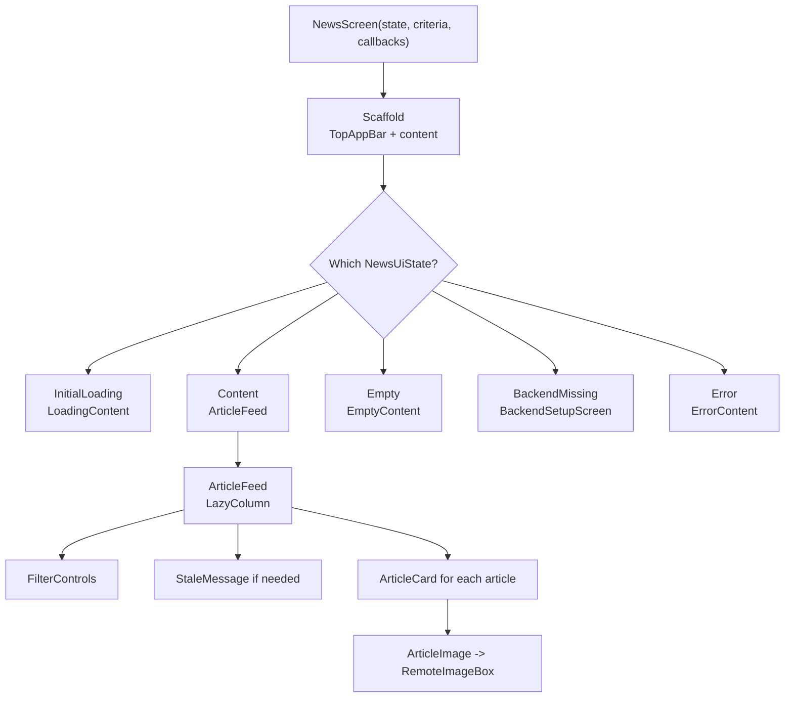
```mermaid
flowchart TD
    Start["NewsScreen(state, criteria, callbacks)"]
    Scaffold["Scaffold\nTopAppBar + content"]
    State{"Which NewsUiState?"}

    Loading["InitialLoading\nLoadingContent"]
    Content["Content\nArticleFeed"]
    Empty["Empty\nEmptyContent"]
    Missing["BackendMissing\nBackendSetupScreen"]
    Error["Error\nErrorContent"]

    Feed["ArticleFeed\nLazyColumn"]
    Filters["FilterControls"]
    Stale["StaleMessage if needed"]
    Cards["ArticleCard for each article"]
    Image["ArticleImage -> RemoteImageBox"]

    Start --> Scaffold --> State
    State --> Loading
    State --> Content
    State --> Empty
    State --> Missing
    State --> Error
    Content --> Feed
    Feed --> Filters
    Feed --> Stale
    Feed --> Cards
    Cards --> Image
```

Concrete files:

- `features/news/presentation/screen/NewsScreen.kt`
  routes `NewsUiState`.
- `features/news/presentation/screen/ArticleFeed.kt`
  renders filters, stale message, and article list.
- `features/news/presentation/filters/FilterControls.kt`
  renders dynamic filter controls.
- `features/news/presentation/components/ArticleCard.kt`
  renders one article row.
- `features/news/presentation/components/ArticleImage.kt`
  maps article image data to shared image UI.
- `core/ui/src/main/java/com/unitynews/core/ui/RemoteImageBox.kt`
  shows remote images with placeholder/error fallback behavior.

## Reader App: Filter Editing Flow

The assignment requires title and rating filters with an Apply/Save button that
applies both together. That is why the ViewModel has draft and applied criteria.

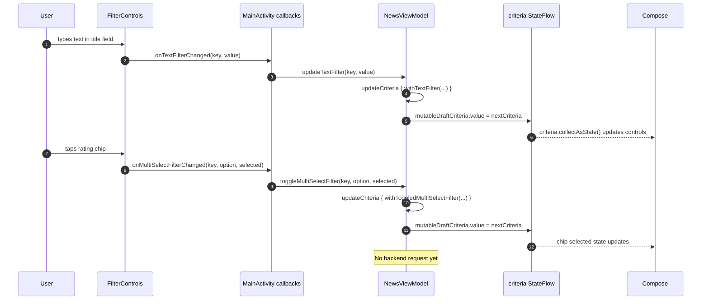
```mermaid
sequenceDiagram
    autonumber
    participant User
    participant Filters as FilterControls
    participant Activity as MainActivity callbacks
    participant VM as NewsViewModel
    participant State as criteria StateFlow
    participant UI as Compose

    User->>Filters: types text in title field
    Filters->>Activity: onTextFilterChanged(key, value)
    Activity->>VM: updateTextFilter(key, value)
    VM->>VM: updateCriteria { withTextFilter(...) }
    VM->>State: mutableDraftCriteria.value = nextCriteria
    State-->>UI: criteria.collectAsState() updates controls

    User->>Filters: taps rating chip
    Filters->>Activity: onMultiSelectFilterChanged(key, option, selected)
    Activity->>VM: toggleMultiSelectFilter(key, option, selected)
    VM->>VM: updateCriteria { withToggledMultiSelectFilter(...) }
    VM->>State: mutableDraftCriteria.value = nextCriteria
    State-->>UI: chip selected state updates

    Note over VM: No backend request yet
```

Important detail:

- Editing controls changes only `mutableDraftCriteria`.
- The backend request waits until the user taps `Apply filters`.
- This lets title and rating be applied as one request.

Dynamic filter detail:

- The UI does not hard-code `"title"` or `"rating"` in `FilterControls`.
- It loops over backend-provided `FilterSpec` objects.
- `FilterSpec.type` decides whether to render `TextFilter`,
  `MultiSelectFilter`, or disabled `UnsupportedFilter`.
- `FilterCriteria.filterValues` stores selections by backend-provided key.

## Reader App: Apply Filters Flow

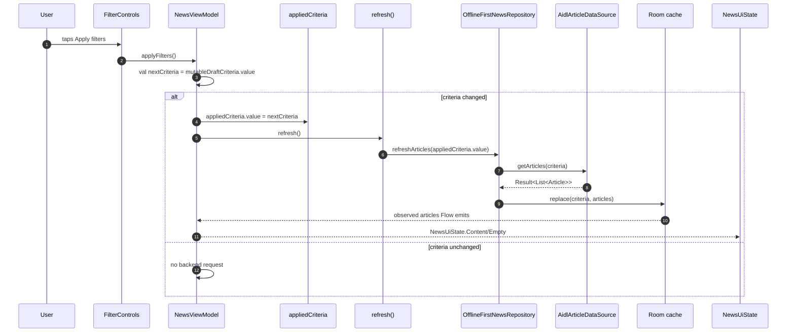
```mermaid
sequenceDiagram
    autonumber
    participant User
    participant Filters as FilterControls
    participant VM as NewsViewModel
    participant Applied as appliedCriteria
    participant Refresh as refresh()
    participant Repo as OfflineFirstNewsRepository
    participant Remote as AidlArticleDataSource
    participant Local as Room cache
    participant State as NewsUiState

    User->>Filters: taps Apply filters
    Filters->>VM: applyFilters()
    VM->>VM: val nextCriteria = mutableDraftCriteria.value
    alt criteria changed
        VM->>Applied: appliedCriteria.value = nextCriteria
        VM->>Refresh: refresh()
        Refresh->>Repo: refreshArticles(appliedCriteria.value)
        Repo->>Remote: getArticles(criteria)
        Remote-->>Repo: Result<List<Article>>
        Repo->>Local: replace(criteria, articles)
        Local-->>VM: observed articles Flow emits
        VM-->>State: NewsUiState.Content/Empty
    else criteria unchanged
        VM->>VM: no backend request
    end
```

The key code is in `NewsViewModel.applyFilters()`:

1. Read `mutableDraftCriteria.value`.
2. Compare it to `appliedCriteria.value`.
3. If different, clear old error/stale messages.
4. Assign `appliedCriteria.value = nextCriteria`.
5. Call `refresh()`.

Because `articles` is built from `combine(appliedCriteria, observeRevision)`,
changing `appliedCriteria` also restarts the local Room observation through
`flatMapLatest`.

## Reader App: Offline-First Refresh Flow

This is the most important production-quality behavior in the reader app.

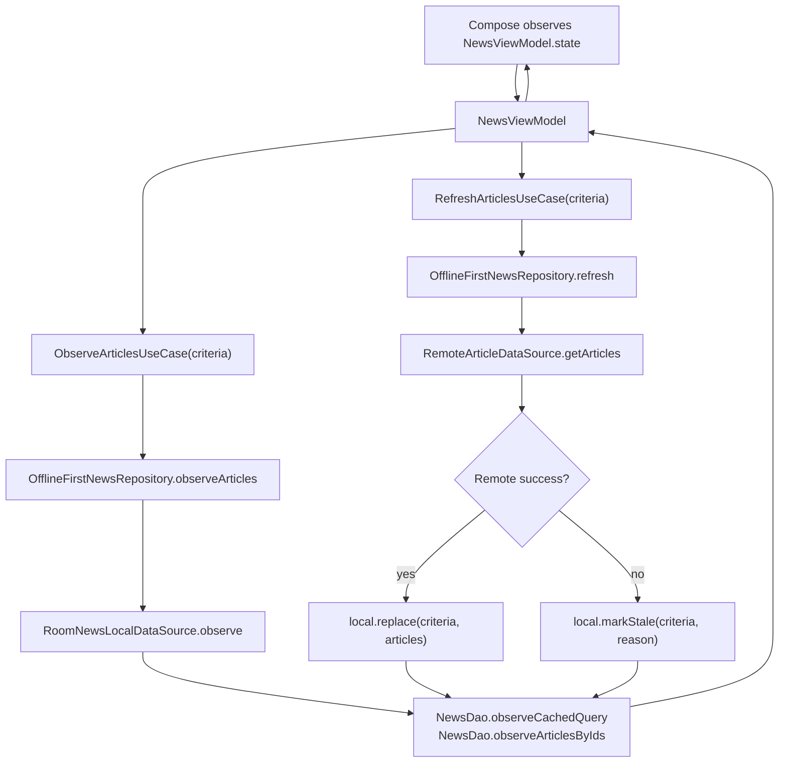
```mermaid
flowchart TD
    UI["Compose observes NewsViewModel.state"]
    VM["NewsViewModel"]
    Observe["ObserveArticlesUseCase(criteria)"]
    RepoObserve["OfflineFirstNewsRepository.observeArticles"]
    LocalObserve["RoomNewsLocalDataSource.observe"]
    DAOObserve["NewsDao.observeCachedQuery\nNewsDao.observeArticlesByIds"]

    Refresh["RefreshArticlesUseCase(criteria)"]
    RepoRefresh["OfflineFirstNewsRepository.refresh"]
    Remote["RemoteArticleDataSource.getArticles"]
    Success{"Remote success?"}
    Replace["local.replace(criteria, articles)"]
    MarkStale["local.markStale(criteria, reason)"]

    UI --> VM
    VM --> Observe --> RepoObserve --> LocalObserve --> DAOObserve
    VM --> Refresh --> RepoRefresh --> Remote --> Success
    Success -->|yes| Replace --> DAOObserve
    Success -->|no| MarkStale --> DAOObserve
    DAOObserve --> VM --> UI
```

`OfflineFirstNewsRepository` behavior:

- `observeArticles(criteria)` always reads local cache.
- `refresh(criteria)` calls remote backend.
- On success, it writes fresh articles to Room.
- On failure, it marks the cached query stale.
- It preserves coroutine cancellation by rethrowing `CancellationException`.

Why this is scalable and testable:

- UI renders from a local observable source, which is fast and resilient.
- Backend refresh can fail without destroying the existing feed.
- The repository hides local/remote coordination from the ViewModel.
- The same repository contract can be backed by AIDL today and HTTP later.

## Reader App: Room Cache Flow

The cache is query-based.

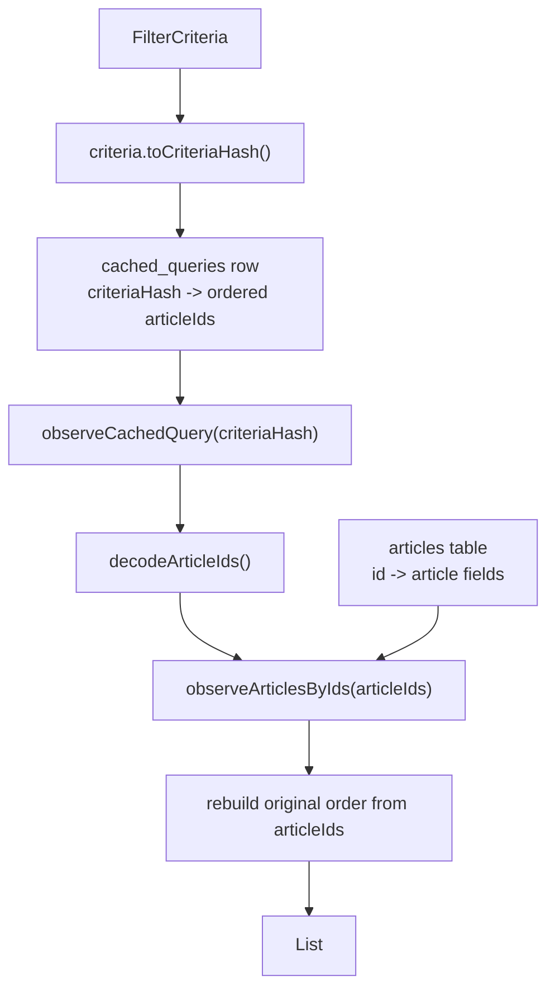
```mermaid
flowchart TD
    Criteria["FilterCriteria"]
    Hash["criteria.toCriteriaHash()"]
    CachedQuery["cached_queries row\ncriteriaHash -> ordered articleIds"]
    Articles["articles table\nid -> article fields"]
    ObserveQuery["observeCachedQuery(criteriaHash)"]
    DecodeIds["decodeArticleIds()"]
    ObserveRows["observeArticlesByIds(articleIds)"]
    Reorder["rebuild original order from articleIds"]
    Domain["List<Article>"]

    Criteria --> Hash --> CachedQuery
    CachedQuery --> ObserveQuery --> DecodeIds --> ObserveRows
    Articles --> ObserveRows
    ObserveRows --> Reorder --> Domain
```

When refresh succeeds:

1. `RoomNewsLocalDataSource.replace(criteria, articles)` is called.
2. It calculates `fetchedAt`.
3. `NewsDao.replaceCachedQuery(...)` runs inside a transaction.
4. DAO upserts article rows into `articles`.
5. DAO upserts one `cached_queries` row for this filter selection.
6. The cached query stores the ordered article ID list.
7. Room emits changes to active observers.

When refresh fails:

1. `OfflineFirstNewsRepository.refresh(...)` receives remote failure.
2. It calls `local.markStale(criteria, reason)`.
3. `NewsDao.markStale(...)` updates the cached query stale reason.
4. If the query never existed, DAO inserts an empty stale entry.
5. UI keeps any previous content where available and shows a stale warning.

## Reader App: AIDL Remote Flow

`AidlArticleDataSource` is the reader-side adapter from domain calls to Android
IPC calls.

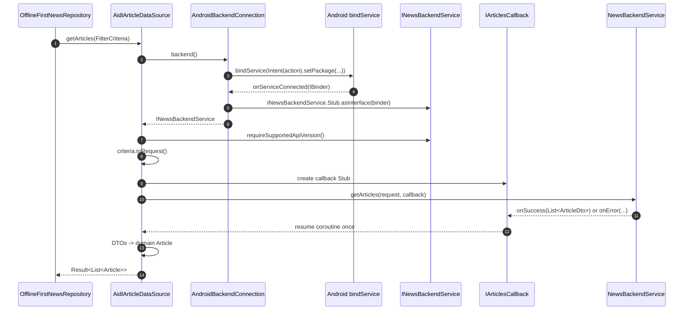
```mermaid
sequenceDiagram
    autonumber
    participant Repo as OfflineFirstNewsRepository
    participant Remote as AidlArticleDataSource
    participant Conn as AndroidBackendConnection
    participant Android as Android bindService
    participant Binder as INewsBackendService
    participant Callback as IArticlesCallback
    participant Backend as NewsBackendService

    Repo->>Remote: getArticles(FilterCriteria)
    Remote->>Conn: backend()
    Conn->>Android: bindService(Intent(action).setPackage(...))
    Android-->>Conn: onServiceConnected(IBinder)
    Conn->>Binder: INewsBackendService.Stub.asInterface(binder)
    Conn-->>Remote: INewsBackendService
    Remote->>Binder: requireSupportedApiVersion()
    Remote->>Remote: criteria.toRequest()
    Remote->>Callback: create callback Stub
    Remote->>Backend: getArticles(request, callback)
    Backend-->>Callback: onSuccess(List<ArticleDto>) or onError(...)
    Callback-->>Remote: resume coroutine once
    Remote->>Remote: DTOs -> domain Article
    Remote-->>Repo: Result<List<Article>>
```

Important implementation points:

- `BackendConnection.connect()` hides Android service binding.
- `AidlArticleDataSource` converts callback-style AIDL into suspend functions.
- `AtomicBoolean completed` ensures only the first callback resumes the coroutine.
- `requireSupportedApiVersion()` fails fast if the backend contract changed.
- `FilterCriteria.toRequest()` generates a `requestId` and sends generic
  `filterValues`.
- DTO mapping happens only in data layer.

Files to know:

- `features/news/data/src/main/java/com/unitynews/news/data/aidl/BackendConnection.kt`
- `features/news/data/src/main/java/com/unitynews/news/data/aidl/AidlArticleDataSource.kt`
- `features/news/data/src/main/aidl/com/unitynews/contract/INewsBackendService.aidl`

## Backend App: Startup And Console Flow

The backend app is visible and independently launchable.

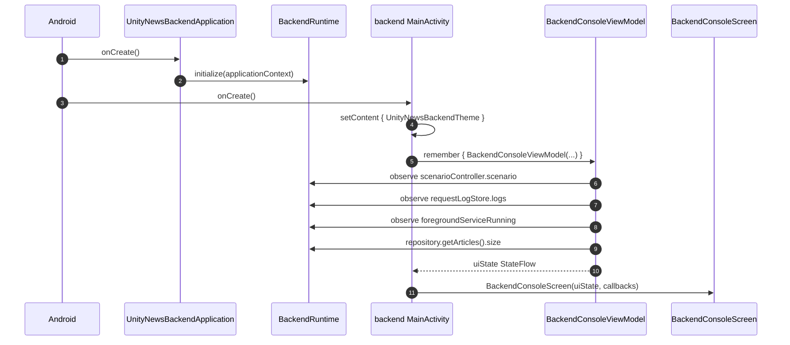
```mermaid
sequenceDiagram
    autonumber
    participant Android
    participant App as UnityNewsBackendApplication
    participant Runtime as BackendRuntime
    participant Activity as backend MainActivity
    participant VM as BackendConsoleViewModel
    participant Screen as BackendConsoleScreen

    Android->>App: onCreate()
    App->>Runtime: initialize(applicationContext)
    Android->>Activity: onCreate()
    Activity->>Activity: setContent { UnityNewsBackendTheme }
    Activity->>VM: remember { BackendConsoleViewModel(...) }
    VM->>Runtime: observe scenarioController.scenario
    VM->>Runtime: observe requestLogStore.logs
    VM->>Runtime: observe foregroundServiceRunning
    VM->>Runtime: repository.getArticles().size
    VM-->>Activity: uiState StateFlow
    Activity->>Screen: BackendConsoleScreen(uiState, callbacks)
```

`BackendRuntime` is a small runtime container shared by:

- backend Activity
- backend foreground service
- backend bound AIDL service

It owns:

- `scenarioController`
- `requestLogStore`
- `filterArticlesUseCase`
- `getFilterSpecsUseCase`
- `callerValidator`
- `repository`
- foreground service running state

In a larger production app, these objects could move to Hilt. In this exercise,
the explicit runtime object makes the backend easy to inspect.

## Backend App: Foreground Service Flow

The foreground service is there to make the backend explicit and long-running.

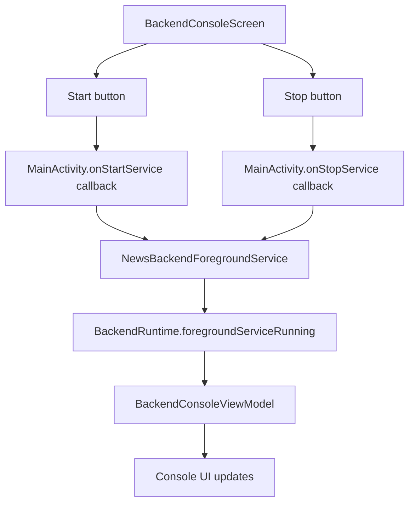
```mermaid
flowchart TD
    Console["BackendConsoleScreen"]
    Start["Start button"]
    Stop["Stop button"]
    ActivityStart["MainActivity.onStartService callback"]
    ActivityStop["MainActivity.onStopService callback"]
    FgService["NewsBackendForegroundService"]
    Runtime["BackendRuntime.foregroundServiceRunning"]
    VM["BackendConsoleViewModel"]
    UI["Console UI updates"]

    Console --> Start --> ActivityStart --> FgService
    Console --> Stop --> ActivityStop --> FgService
    FgService --> Runtime --> VM --> UI
```

The bound AIDL service and the foreground service are different Android
components:

- `NewsBackendService` is the bound IPC API used by the reader app.
- `NewsBackendForegroundService` keeps the backend process explicit and visible.

## Backend App: Reader Request Flow

This is what happens when the reader asks for filtered articles.

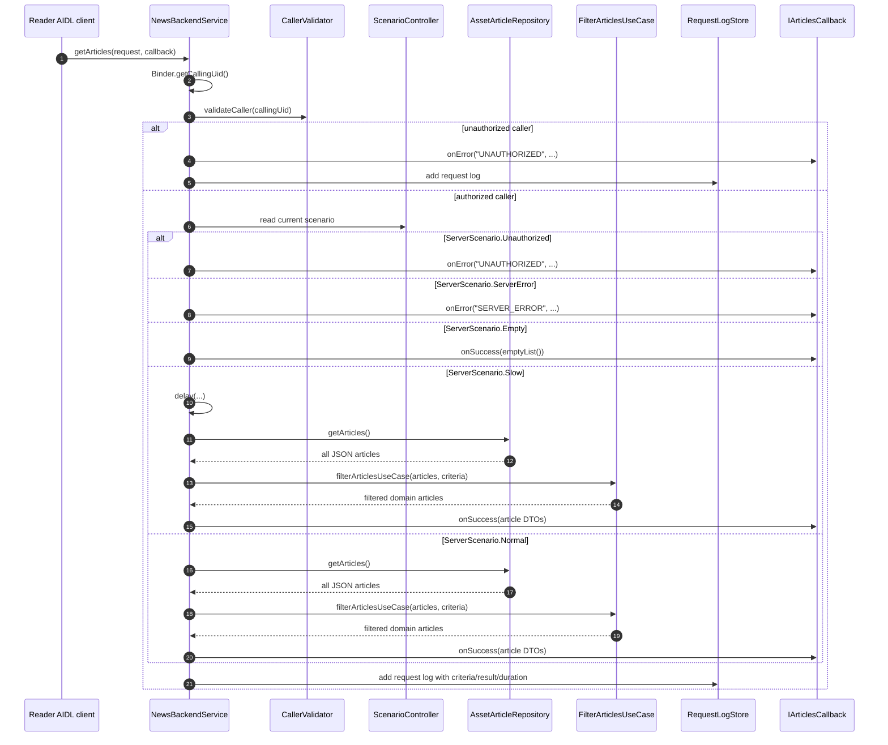
```mermaid
sequenceDiagram
    autonumber
    participant Reader as Reader AIDL client
    participant Service as NewsBackendService
    participant Validator as CallerValidator
    participant Scenario as ScenarioController
    participant Repo as AssetArticleRepository
    participant Filter as FilterArticlesUseCase
    participant Log as RequestLogStore
    participant Callback as IArticlesCallback

    Reader->>Service: getArticles(request, callback)
    Service->>Service: Binder.getCallingUid()
    Service->>Validator: validateCaller(callingUid)
    alt unauthorized caller
        Service->>Callback: onError("UNAUTHORIZED", ...)
        Service->>Log: add request log
    else authorized caller
        Service->>Scenario: read current scenario
        alt ServerScenario.Unauthorized
            Service->>Callback: onError("UNAUTHORIZED", ...)
        else ServerScenario.ServerError
            Service->>Callback: onError("SERVER_ERROR", ...)
        else ServerScenario.Empty
            Service->>Callback: onSuccess(emptyList())
        else ServerScenario.Slow
            Service->>Service: delay(...)
            Service->>Repo: getArticles()
            Repo-->>Service: all JSON articles
            Service->>Filter: filterArticlesUseCase(articles, criteria)
            Filter-->>Service: filtered domain articles
            Service->>Callback: onSuccess(article DTOs)
        else ServerScenario.Normal
            Service->>Repo: getArticles()
            Repo-->>Service: all JSON articles
            Service->>Filter: filterArticlesUseCase(articles, criteria)
            Filter-->>Service: filtered domain articles
            Service->>Callback: onSuccess(article DTOs)
        end
        Service->>Log: add request log with criteria/result/duration
    end
```

Concrete code path:

1. Reader calls `INewsBackendService.getArticles(request, callback)`.
2. Backend enters `NewsBackendService.getArticles(...)`.
3. Backend captures `Binder.getCallingUid()`.
4. Backend validates caller with `BackendRuntime.callerValidator`.
5. Backend reads the current `ServerScenario`.
6. Backend converts `ArticleFilterRequest` to backend `FilterCriteria`.
7. If scenario is error/empty/slow, backend simulates that behavior.
8. For normal filtering, backend calls `returnFilteredArticles(...)`.
9. `returnFilteredArticles(...)` loads all articles from repository.
10. It calls `BackendRuntime.filterArticlesUseCase(articles, criteria)`.
11. It maps domain `Article` to `ArticleDto`.
12. It sends `callback.onSuccess(articles)`.
13. It writes a compact request log for the console.

## Backend App: JSON Source Flow

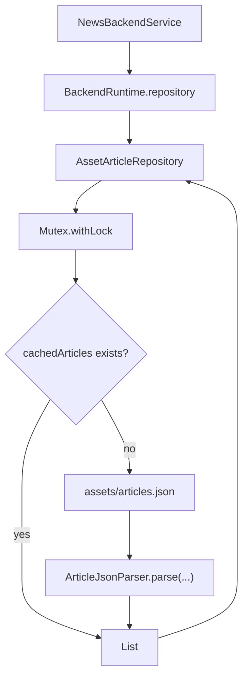
```mermaid
flowchart TD
    Service["NewsBackendService"]
    Runtime["BackendRuntime.repository"]
    Repo["AssetArticleRepository"]
    Mutex["Mutex.withLock"]
    Cache{"cachedArticles exists?"}
    Assets["assets/articles.json"]
    Parser["ArticleJsonParser.parse(...)"]
    Domain["List<Article>"]

    Service --> Runtime --> Repo --> Mutex --> Cache
    Cache -->|yes| Domain
    Cache -->|no| Assets --> Parser --> Domain
    Domain --> Repo
```

`AssetArticleRepository` behavior:

- Reads `backend/app/src/main/assets/articles.json`.
- Parses it lazily on first request.
- Stores the immutable article list in `cachedArticles`.
- Uses a `Mutex` so two concurrent backend requests do not parse the file twice.

The assignment forbids network calls for this data source, so this repository is
local-asset based by design.

## Backend App: Filter Metadata Flow

The reader does not invent filters on its own. It asks the backend what filters
are available.

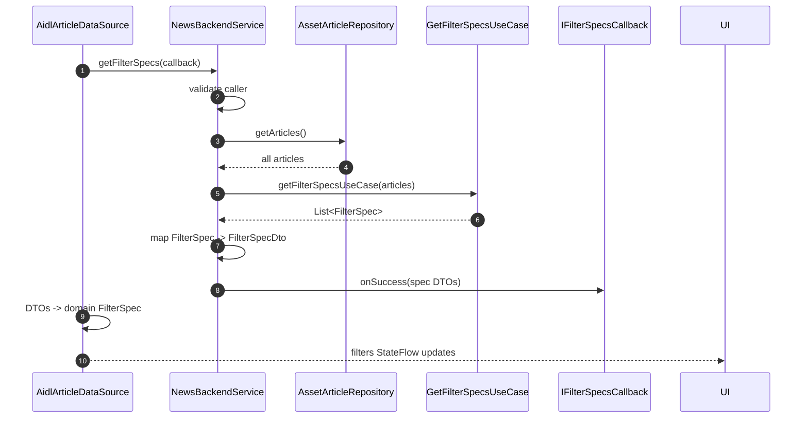
```mermaid
sequenceDiagram
    autonumber
    participant Reader as AidlArticleDataSource
    participant Service as NewsBackendService
    participant Repo as AssetArticleRepository
    participant Specs as GetFilterSpecsUseCase
    participant Callback as IFilterSpecsCallback

    Reader->>Service: getFilterSpecs(callback)
    Service->>Service: validate caller
    Service->>Repo: getArticles()
    Repo-->>Service: all articles
    Service->>Specs: getFilterSpecsUseCase(articles)
    Specs-->>Service: List<FilterSpec>
    Service->>Service: map FilterSpec -> FilterSpecDto
    Service->>Callback: onSuccess(spec DTOs)
    Reader->>Reader: DTOs -> domain FilterSpec
    Reader-->>UI: filters StateFlow updates
```

Current backend filter definitions:

- `title`: text filter.
- `rating`: multi-select filter.

Rating options are data-driven:

1. Backend scans article ratings.
2. It distincts and sorts them.
3. It sends those options to the reader.

That means adding new rating values in the JSON updates the available rating
chips without changing reader UI code.

## Backend App: Filtering Rules

Filtering lives in:

`backend/features/server/domain/src/main/java/com/unitynews/server/domain/usecase/FilterArticlesUseCase.kt`

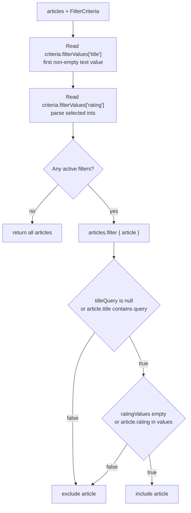
```mermaid
flowchart TD
    Input["articles + FilterCriteria"]
    Title["Read criteria.filterValues['title']\nfirst non-empty text value"]
    Rating["Read criteria.filterValues['rating']\nparse selected ints"]
    Any{"Any active filters?"}
    ReturnAll["return all articles"]
    Loop["articles.filter { article }"]
    MatchTitle{"titleQuery is null\nor article.title contains query"}
    MatchRating{"ratingValues empty\nor article.rating in values"}
    Include["include article"]
    Exclude["exclude article"]

    Input --> Title --> Rating --> Any
    Any -->|no| ReturnAll
    Any -->|yes| Loop --> MatchTitle
    MatchTitle -->|false| Exclude
    MatchTitle -->|true| MatchRating
    MatchRating -->|true| Include
    MatchRating -->|false| Exclude
```

Why `"title"` and `"rating"` exist here:

- The backend owns filter semantics.
- The reader only renders and sends generic key/value selections.
- The backend decides what `"title"` and `"rating"` mean.

If we add a new backend filter:

1. Add a new `FilterSpec` in backend `GetFilterSpecsUseCase`.
2. Add matching interpretation in backend `FilterArticlesUseCase`.
3. If it uses an already supported UI type such as text or multi-select, the
   reader UI can render it without structural changes.

## Image Loading Flow

The assignment requires image URLs plus placeholder color.

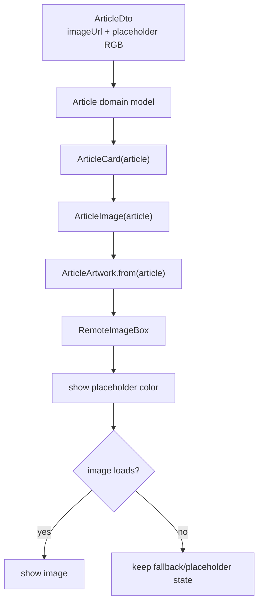
```mermaid
flowchart TD
    ArticleDto["ArticleDto\nimageUrl + placeholder RGB"]
    Domain["Article domain model"]
    Card["ArticleCard(article)"]
    ArticleImage["ArticleImage(article)"]
    Artwork["ArticleArtwork.from(article)"]
    RemoteBox["RemoteImageBox"]
    Placeholder["show placeholder color"]
    Load{"image loads?"}
    Image["show image"]
    Error["keep fallback/placeholder state"]

    ArticleDto --> Domain --> Card --> ArticleImage --> Artwork --> RemoteBox --> Placeholder --> Load
    Load -->|yes| Image
    Load -->|no| Error
```

Important explanation:

- Placeholder color comes from the JSON data and travels through DTO/domain/UI.
- Bad image URLs should not break the list.
- The UI component owns graceful image rendering behavior.
- Article text remains readable even if an image cannot load.

## Missing Backend Flow

When the reader cannot bind/call the backend:

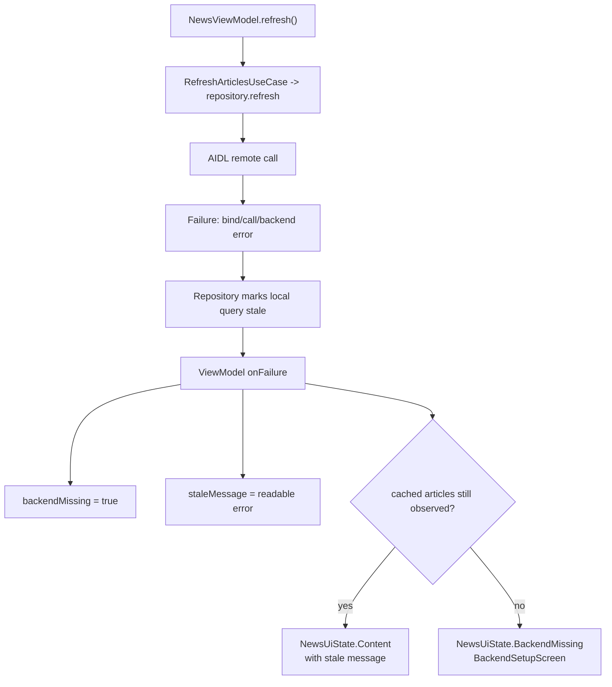
```mermaid
flowchart TD
    Refresh["NewsViewModel.refresh()"]
    Repo["RefreshArticlesUseCase -> repository.refresh"]
    Remote["AIDL remote call"]
    Failure["Failure: bind/call/backend error"]
    Mark["Repository marks local query stale"]
    VM["ViewModel onFailure"]
    Missing["backendMissing = true"]
    Stale["staleMessage = readable error"]
    HasCache{"cached articles still observed?"}
    Content["NewsUiState.Content\nwith stale message"]
    Setup["NewsUiState.BackendMissing\nBackendSetupScreen"]

    Refresh --> Repo --> Remote --> Failure --> Mark --> VM
    VM --> Missing
    VM --> Stale
    VM --> HasCache
    HasCache -->|yes| Content
    HasCache -->|no| Setup
```

Why cached content can still appear:

- `backendMissing` does not automatically hide articles.
- `NewsViewModel.state` chooses `Content` before `BackendMissing`.
- If Room has cached articles, the feed remains visible and a stale message can
  explain that the latest refresh failed.

## How To Explain The Future HTTP Backend Swap

The design deliberately places backend transport behind `RemoteArticleDataSource`.

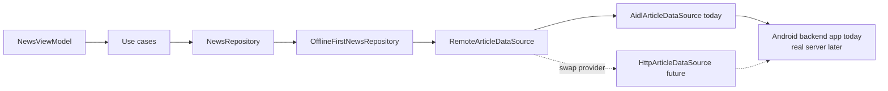
```mermaid
flowchart LR
    VM["NewsViewModel"]
    UseCases["Use cases"]
    Repo["NewsRepository"]
    OfflineRepo["OfflineFirstNewsRepository"]
    RemoteInterface["RemoteArticleDataSource"]
    AIDL["AidlArticleDataSource today"]
    HTTP["HttpArticleDataSource future"]
    Backend["Android backend app today\nreal server later"]

    VM --> UseCases --> Repo --> OfflineRepo --> RemoteInterface
    RemoteInterface --> AIDL --> Backend
    RemoteInterface -. "swap provider" .-> HTTP -.-> Backend
```

Interview sentence:

> To move from the Android backend app to a real server, I would keep the
> ViewModel, use cases, domain models, and offline-first repository. I would add
> an HTTP implementation of `RemoteArticleDataSource`, map server JSON to the
> same domain models, and change the DI provider.

## End-To-End Happy Path

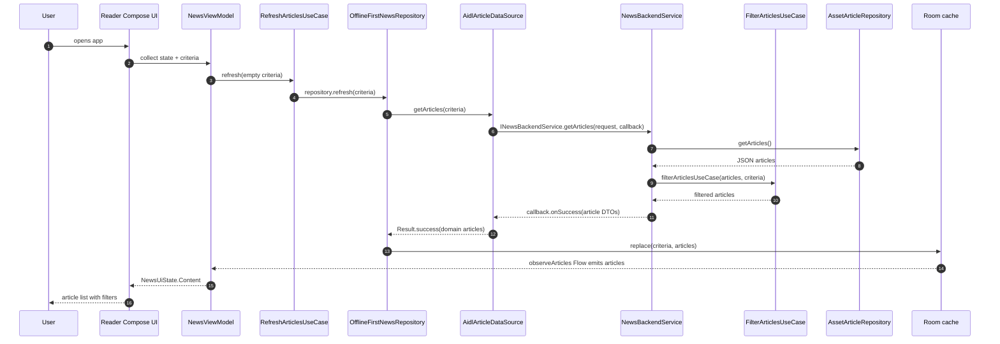
```mermaid
sequenceDiagram
    autonumber
    participant User
    participant ReaderUI as Reader Compose UI
    participant VM as NewsViewModel
    participant UseCase as RefreshArticlesUseCase
    participant Repo as OfflineFirstNewsRepository
    participant AIDL as AidlArticleDataSource
    participant Backend as NewsBackendService
    participant Domain as FilterArticlesUseCase
    participant Asset as AssetArticleRepository
    participant Room as Room cache

    User->>ReaderUI: opens app
    ReaderUI->>VM: collect state + criteria
    VM->>UseCase: refresh(empty criteria)
    UseCase->>Repo: repository.refresh(criteria)
    Repo->>AIDL: getArticles(criteria)
    AIDL->>Backend: INewsBackendService.getArticles(request, callback)
    Backend->>Asset: getArticles()
    Asset-->>Backend: JSON articles
    Backend->>Domain: filterArticlesUseCase(articles, criteria)
    Domain-->>Backend: filtered articles
    Backend-->>AIDL: callback.onSuccess(article DTOs)
    AIDL-->>Repo: Result.success(domain articles)
    Repo->>Room: replace(criteria, articles)
    Room-->>VM: observeArticles Flow emits articles
    VM-->>ReaderUI: NewsUiState.Content
    ReaderUI-->>User: article list with filters
```

## End-To-End Apply Rating Filter Path

```mermaid
sequenceDiagram
    autonumber
    participant User
    participant Filters as FilterControls
    participant VM as NewsViewModel
    participant Repo as OfflineFirstNewsRepository
    participant Backend as NewsBackendService
    participant Filter as FilterArticlesUseCase
    participant Room
    participant UI

    User->>Filters: selects rating "1"
    Filters->>VM: toggleMultiSelectFilter("rating", "1", true)
    VM->>VM: draft criteria now has rating=1
    Note over VM: No backend call yet
    User->>Filters: taps Apply filters
    Filters->>VM: applyFilters()
    VM->>VM: appliedCriteria = draft criteria
    VM->>Repo: refresh(criteria rating=1)
    Repo->>Backend: AIDL getArticles(request rating=1)
    Backend->>Filter: filter articles where rating in setOf(1)
    Filter-->>Backend: only 1-rating articles
    Backend-->>Repo: callback success
    Repo->>Room: replace query cache for rating=1
    Room-->>VM: emits cached rating=1 articles
    VM-->>UI: NewsUiState.Content
```

If articles disappear temporarily, the likely reason is:

- The applied criteria changed, so Room starts observing a different query hash.
- If that query was not cached yet, it may emit empty until refresh writes the
  backend response.
- The intended path is that `refresh()` then writes the filtered result and Room
  emits the new list.

## Files To Open During The Interview

Open these in this order if asked to walk through the project:

1. `UnityNewsApp/app/src/main/java/com/example/unitynewsapp/MainActivity.kt`
   - Shows thin Activity and Compose entry point.
2. `UnityNewsApp/features/news/presentation/src/main/java/com/unitynews/news/presentation/NewsViewModel.kt`
   - Shows state, draft/applied filters, refresh flow, and UI state mapping.
3. `UnityNewsApp/features/news/presentation/src/main/java/com/unitynews/news/presentation/screen/NewsScreen.kt`
   - Shows how UI state chooses screen content.
4. `UnityNewsApp/features/news/presentation/src/main/java/com/unitynews/news/presentation/filters/FilterControls.kt`
   - Shows dynamic backend-driven filters.
5. `UnityNewsApp/features/news/data/src/main/java/com/unitynews/news/data/OfflineFirstNewsRepository.kt`
   - Shows observe local, refresh remote, write cache.
6. `UnityNewsApp/features/news/data/src/main/java/com/unitynews/news/data/aidl/AidlArticleDataSource.kt`
   - Shows the AIDL adapter and DTO mapping.
7. `UnityNewsApp/features/news/data/src/main/java/com/unitynews/news/data/aidl/BackendConnection.kt`
   - Shows Android service binding.
8. `backend/app/src/main/java/com/example/unitynewsbackend/service/NewsBackendService.kt`
   - Shows the backend API surface.
9. `backend/features/server/domain/src/main/java/com/unitynews/server/domain/usecase/FilterArticlesUseCase.kt`
   - Shows backend-owned filtering logic.
10. `backend/features/server/data/src/main/java/com/unitynews/server/data/AssetArticleRepository.kt`
    - Shows local JSON data ownership.

## Common Interview Questions And Answers

### Why AIDL instead of intents?

AIDL gives a typed IPC contract with callbacks and versioning. It is closer to a
real client/server boundary than passing large result payloads through intents.
It also makes the backend app feel like a service provider while still being a
separate Android app.

### Why does the ViewModel inject use cases instead of the repository?

Use cases make the ViewModel read like user actions:

- observe articles
- refresh articles
- get filter specs

The ViewModel does not need to know repository orchestration details. This keeps
presentation easier to test and easier to explain.

### Why Room if the backend already filters?

Room gives offline-first behavior. The backend is still the source of truth for
filtering, but the reader keeps the latest responses by query. If the backend is
missing or temporarily failing, the reader can still render useful cached data.

### Where does filtering happen?

Filtering happens in the backend app, inside
`FilterArticlesUseCase`. The reader only sends generic `FilterCriteria`.

### Are filters dynamic?

The reader dynamically renders backend-provided `FilterSpec` objects. The
backend currently defines the semantics for `title` and `rating`. Adding a new
filter with an already supported UI type can be done by extending backend filter
metadata and backend filtering logic without restructuring the reader UI.

### How would this scale to a real server?

Keep domain, presentation, use cases, and offline cache. Replace
`AidlArticleDataSource` with a network-backed `RemoteArticleDataSource`. For a
very large article set, the next step would be cursor-based pagination from the
backend plus a paged local cache.

### Where would I debug if the UI is empty?

Check in this order:

1. `NewsViewModel.state`: is it `BackendMissing`, `Empty`, or `Content`?
2. `NewsViewModel.appliedCriteria`: which criteria is currently active?
3. Backend console request logs: did the backend receive the request?
4. `NewsBackendService`: did it return success, empty, or error scenario?
5. `FilterArticlesUseCase`: did the filter remove all articles?
6. Room cache: did `replaceCachedQuery` write the query mapping?

## Mental Model To Remember

```mermaid
flowchart LR
    User["User action"]
    Compose["Compose UI"]
    VM["ViewModel"]
    Domain["Use cases"]
    Repo["Offline-first repository"]
    Cache["Room cache"]
    Remote["AIDL remote data source"]
    Backend["Backend app"]
    Json["Bundled JSON"]

    User --> Compose --> VM --> Domain --> Repo
    Repo --> Cache
    Repo --> Remote --> Backend --> Json
    Backend --> Remote --> Repo --> Cache
    Cache --> VM --> Compose
```

Short version:

> The screen observes the ViewModel. The ViewModel observes use cases. The
> repository observes Room and refreshes from AIDL. The backend owns JSON and
> filtering. Successful backend responses update Room. Room emits. Compose
> redraws.
