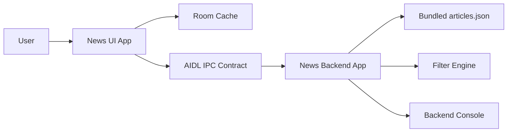
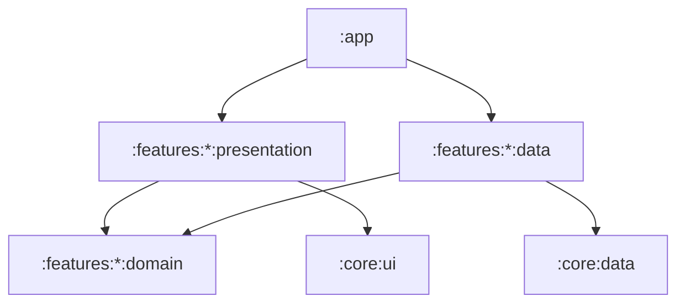
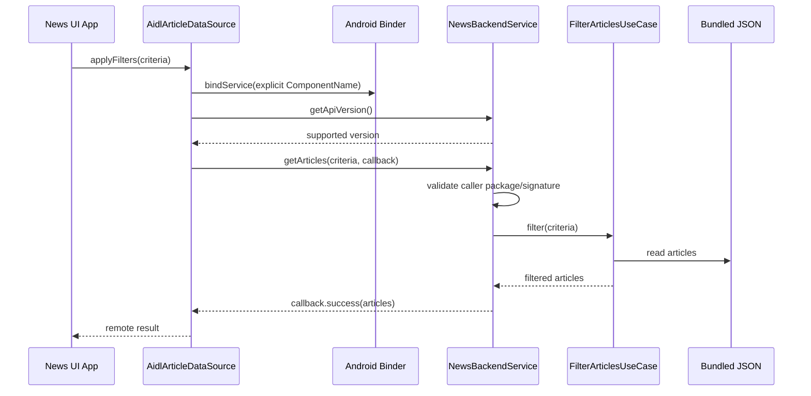
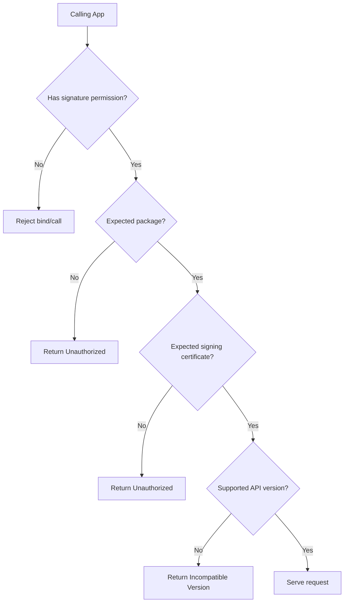
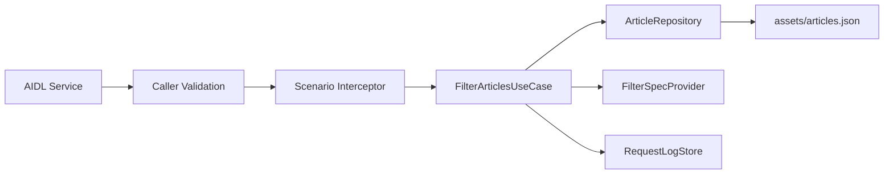
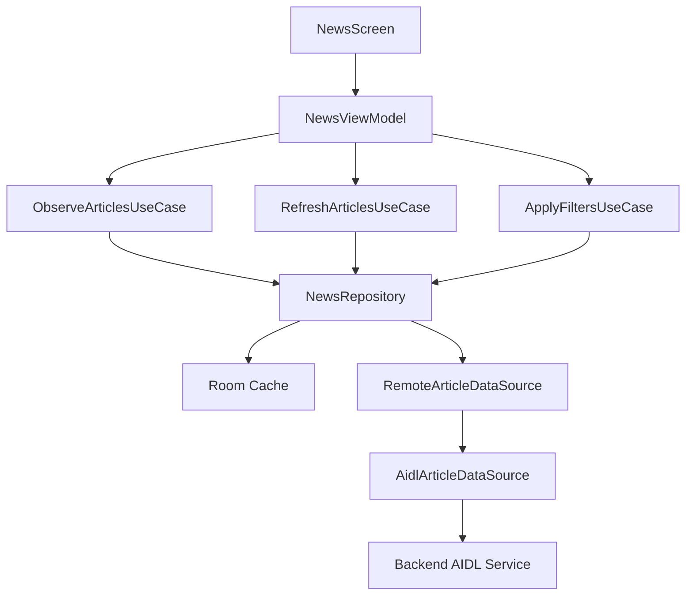
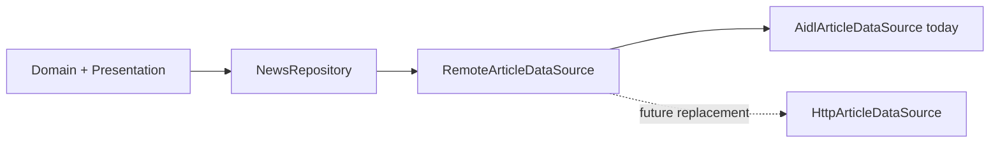
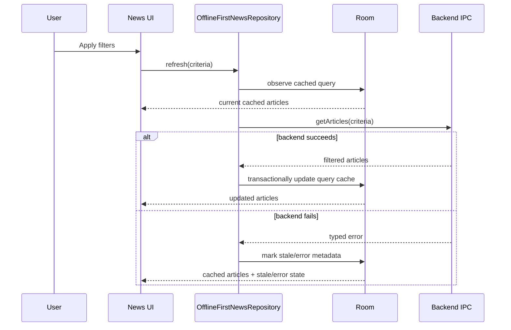
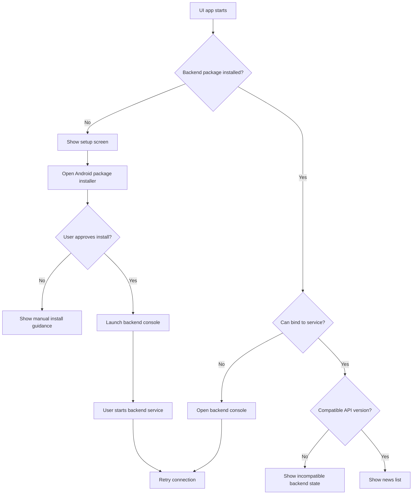

# Unity News Architecture Design

Date: 2026-06-18

## Overview

Unity News is composed of two independently installable Android applications:

- **News UI app**: owns the user experience, filter controls, local cache, and news list rendering.
- **News Backend app**: owns the bundled article dataset, filter execution, inter-app API, runtime status, and fault simulation.

The applications communicate through a versioned Android IPC contract. The UI application does not read the backend dataset directly and does not duplicate backend filtering rules. This preserves a clear client/server boundary while keeping both deliverables Android applications.

## Design Goals

- Keep the two applications independently buildable, installable, and launchable.
- Use a communication mechanism that is native to Android and defensible from a security perspective.
- Keep backend-owned filtering behind a stable contract.
- Allow the UI app to migrate from the Android backend app to a real remote backend by replacing only the data-source implementation.
- Make the UI app offline-first so cached articles remain available when the backend is unavailable.
- Make filter controls extensible without requiring a structural rewrite of the UI layer.
- Provide a visible backend console so runtime behavior, request logs, scenarios, and security state can be inspected.
- Include tests at the domain, data, presentation, and contract levels.

## Non-Goals

- User login, accounts, or persisted per-user preferences.
- Article detail screen.
- Runtime network fetching for the backend dataset.
- Silent installation of the backend application.
- Silent startup of privileged or background behavior from the UI application.
- Claiming that Android APKs are impossible to reverse engineer.

## System Context



The backend owns the source data and filter execution. The UI app sends filter criteria to the backend and renders the returned article set from its local cache.

## Application Responsibilities

| Area | News UI App | News Backend App |
| --- | --- | --- |
| User experience | News list, filters, setup flow, cache/error states | Operator console |
| Source data | No direct dataset ownership | Bundled `articles.json` |
| Filtering | Builds criteria only | Executes all filter logic |
| Communication | AIDL client | AIDL bound service |
| Persistence | Room offline cache | In-memory runtime state and bundled asset |
| Security | Explicit binding, version validation, backend signature verification | Signature permission, caller validation, typed authorization failures |
| Fault scenarios | Renders resilient states | Provides normal, slow, empty, error, unauthorized modes |

## Repository Layout

The repository contains two separate Android Gradle projects:

```text
unity-news-app/
  UnityNewsApp/
  backend/
  docs/
    DESIGN.md
  scripts/
    verify-aidl-contracts.sh
```

The apps intentionally remain separate projects. There is no shared runtime module between them. The shared boundary is the duplicated and verified AIDL contract, similar to how a production client/server system would use a versioned API artifact.

## Module Architecture

Each application uses the same scalable module pattern.

### News UI App

```text
UnityNewsApp/
  app/
  core/ui/
  core/data/
  features/news/data/
  features/news/domain/
  features/news/presentation/
```

### News Backend App

```text
backend/
  app/
  core/ui/
  core/data/
  features/server/data/
  features/server/domain/
  features/server/presentation/
```

### Dependency Direction



Rules:

- Domain modules define entities, repository interfaces, and use cases.
- Data modules implement repositories, persistence, IPC adapters, mappers, and asset readers.
- Presentation modules depend on domain contracts and expose UI state.
- Hilt binds interfaces to implementations at module boundaries.
- Tests replace data sources and repositories with fakes without changing domain or presentation.

## Communication Design

Communication uses an exported AIDL bound service in the backend app. The UI app binds with an explicit component name.



The contract is asynchronous. This avoids blocking Binder threads and allows the backend to simulate slow responses cleanly.

### AIDL Contract Shape

```text
INewsBackendService
  int getApiVersion()
  void getFilterSpecs(IFilterSpecsCallback callback)
  void getArticles(ArticleFilterRequest request, IArticlesCallback callback)
  void getBackendStatus(IBackendStatusCallback callback)
```

Primary DTOs:

```text
ArticleDto
  id
  title
  description
  imageUrl
  rating
  placeholderRed
  placeholderGreen
  placeholderBlue

ArticleFilterRequest
  titleQuery
  ratingValues
  requestId

FilterSpecDto
  key
  label
  type
  options

BackendStatusDto
  isRunning
  scenario
  articleCount
```

The AIDL files are duplicated in both projects:

```text
UnityNewsApp/features/news/data/src/main/aidl/com/unitynews/contract/
backend/features/server/data/src/main/aidl/com/unitynews/contract/
```

`scripts/verify-aidl-contracts.sh` compares both directories and fails if the contract drifts.

## Security Model

The backend service is exported intentionally, but access is restricted.



Security controls:

- Custom signature-level permission protects the backend service.
- UI app binds with an explicit `ComponentName`.
- Backend validates caller UID, package name, and signing certificate.
- Backend returns typed unauthorized errors.
- No real secrets are embedded in either APK.
- Release builds enable R8 minification and resource shrinking.
- ProGuard/R8 keep rules remain narrow and specific.
- Request logs avoid sensitive data.

Obfuscation raises the cost of reverse engineering but is not treated as the access-control mechanism. Access control is enforced by Android permissions, explicit binding, signing validation, and runtime caller checks.

## Backend Application Design

The backend application exposes a visible operator console and owns all server-side behavior.

### Backend Data Flow



### Backend Modules

```text
features/server/domain
  Article
  FilterCriteria
  FilterSpec
  ArticleRepository
  FilterArticlesUseCase
  GetFilterSpecsUseCase
  ServerScenario

features/server/data
  AssetArticleRepository
  ArticleJsonParser
  AidlServiceAdapter
  RequestLogStore
  CallerValidator

features/server/presentation
  BackendConsoleViewModel
  BackendConsoleUiState
  BackendConsoleScreen
```

The backend bundles the data file at:

```text
backend/app/src/main/assets/articles.json
```

Filtering rules:

- Empty criteria returns all articles.
- Title filtering is case-insensitive `contains`.
- Rating filtering supports one or more selected rating values.
- Title and rating criteria are applied together.
- Rating filter options are derived from the bundled dataset.

### Backend Console

The console displays:

- service running/stopped state;
- foreground service state;
- current scenario;
- article count;
- available filter specifications;
- latest caller package/UID;
- request log entries;
- last request duration and result count;
- security validation status.

The console supports:

- start service;
- stop service;
- change scenario;
- clear request logs.

### Foreground Service

The backend runtime is started by the user from the backend console. The foreground service shows a persistent notification while running and exposes a stop action. The console also provides a stop action.

This keeps the service lifecycle explicit and visible. The design does not rely on hidden or unrestricted background execution.

## Fault Simulation

Fault modes are part of the backend runtime:

| Mode | Backend behavior | UI behavior to verify |
| --- | --- | --- |
| `Normal` | Returns filtered data | Content renders and cache updates |
| `Slow` | Delays callback | Loading/refreshing state remains stable |
| `Empty` | Returns empty list | Empty state renders |
| `ServerError` | Returns typed error | Cached content remains visible when available |
| `Unauthorized` | Returns authorization failure | Unauthorized state renders |

These modes make resilience visible during a design review and are covered by tests.

## UI Application Design

The UI app is a focused news reader. It does not include article details, accounts, or dashboard-style analytics.

### UI Data Flow



### UI Modules

```text
features/news/domain
  Article
  FilterCriteria
  FilterSpec
  NewsRepository
  ObserveArticlesUseCase
  RefreshArticlesUseCase
  ApplyFiltersUseCase

features/news/data
  OfflineFirstNewsRepository
  RoomArticleLocalDataSource
  RemoteArticleDataSource
  AidlArticleDataSource
  ArticleEntity
  CachedQueryEntity
  CacheMetadataEntity
  mappers

features/news/presentation
  NewsViewModel
  NewsUiState
  NewsScreen
  FilterControls
```

The key migration seam is `RemoteArticleDataSource`:



Moving from the Android backend app to a real server requires a new `RemoteArticleDataSource` implementation. Domain and presentation remain unchanged.

## Offline-First Cache

The UI app uses Room as its source of truth.



Room entities:

```text
ArticleEntity
  id
  title
  description
  imageUrl
  rating
  placeholderRed
  placeholderGreen
  placeholderBlue
  lastFetchedAt

CachedQueryEntity
  criteriaHash
  articleIds
  lastSuccessfulRefreshAt
  staleReason

CacheMetadataEntity
  key
  value
  updatedAt
```

The cache is keyed by criteria hash so the app can show the last successful result for an applied filter set when the backend is unavailable.

## Dynamic Filters

The backend exposes filter specifications. The UI renders controls from those specifications.

Initial filter specs:

| Key | Type | Source |
| --- | --- | --- |
| `title` | text | static backend filter definition |
| `rating` | select/multi-select | values derived from bundled dataset |

Adding a new filter later requires backend support for the filter and a UI control renderer for the declared type. It does not require rewriting the screen, ViewModel, or repository contracts.

Unsupported filter types are shown as unavailable instead of crashing the UI.

## Backend Setup Flow

If the UI app cannot detect or bind to the backend app, it shows a setup screen.



Installation uses Android's system package installer. The UI app does not silently install the backend app and does not silently start the backend foreground service.

## Error And State Model

The UI exposes explicit states:

- `InitialLoading`
- `Content`
- `RefreshingWithContent`
- `Empty`
- `StaleContent`
- `BackendMissing`
- `BackendUnavailable`
- `Unauthorized`
- `IncompatibleBackend`
- `FatalError`

Backend errors are typed at the IPC boundary and mapped into domain/presentation states.

## Testing Strategy

### Backend Tests

- Parses bundled JSON into article models.
- Generates filter specs from the dataset.
- Filters by title.
- Filters by rating.
- Applies title and rating together.
- Handles empty criteria.
- Handles empty results.
- Applies scenario behavior.
- Rejects invalid caller package/signature cases.

### UI Data Tests

- Observes cached data.
- Writes refreshed articles transactionally.
- Preserves cached content on backend failure.
- Updates stale metadata.
- Caches filtered results by criteria hash.
- Maps unsupported backend version to domain error.
- Swaps fake remote data source without changing domain tests.

### UI Presentation Tests

- Maps filter specs to UI controls.
- Builds expected criteria from user input.
- Applies filters through the ViewModel.
- Emits loading, content, empty, stale, backend missing, unauthorized, and incompatible states.
- Routes backend missing state to setup flow.

### Contract Tests

- Verifies duplicated AIDL files are identical.
- Verifies API version compatibility behavior.

## Build And Verification

Expected local checks:

```bash
./UnityNewsApp/gradlew testDebugUnitTest
./UnityNewsApp/gradlew assembleDebug
./backend/gradlew testDebugUnitTest
./backend/gradlew assembleDebug
./scripts/verify-aidl-contracts.sh
```

Release checks:

```bash
./UnityNewsApp/gradlew assembleRelease
./backend/gradlew assembleRelease
```

Release builds enable:

- R8 minification;
- resource shrinking;
- narrow keep rules for AIDL, Parcelables, and serialization only where required.

## Review Flow

1. Install both APKs.
2. Open the backend app.
3. Start the backend foreground service.
4. Open the UI app.
5. Apply title and rating filters.
6. Confirm backend request logs update.
7. Switch backend scenarios: `Slow`, `Empty`, `ServerError`, `Unauthorized`.
8. Confirm the UI renders the expected loading, empty, stale, and error states.
9. Stop the backend service.
10. Confirm cached content remains visible in the UI app.
11. Optional: remove the backend app and verify the UI setup flow.

## Development Tooling Disclosure

AI tooling was used as an engineering assistant during design and implementation. Human review drove the final architecture decisions.

Examples of useful acceleration:

- Diagnosed the AndroidX Core and `compileSdk` mismatch during initial project setup.
- Helped compare inter-app communication options before selecting AIDL.

Examples of human correction:

- Runtime Gist fetching was rejected after validating the requirement that the backend dataset must be bundled locally.
- A local HTTP server was rejected in favor of Android-native IPC after evaluating the security and platform fit.

The final architecture decisions are documented above: separate projects, AIDL, strict IPC security, offline-first cache, backend-owned dynamic filtering, foreground-service-backed backend runtime, and explicit setup flow.
